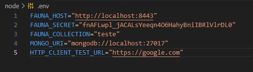

<div align="center">

# Adapters


</div>

Seguindo os princípios do [Ports and Adapters - _Alistair Cockburn_](https://alistair.cockburn.us/hexagonal-architecture/) essa _lib_ é um agregado de adaptadores utilizados por outros pacotes do projeto **CodePlayData**. A ideia é se preocupar menos com aplicações de terceiros, _i.e._ banco de dados, servidos/clients http, e mais com os objetos específicos do seu projeto, como os repositórios e gateways.

<br>

> Os comentários no código estarão em inglês e a documentação/testes em português.

<br>

## Como Usar

Em uma situação em que sua infraestrutra dependa de um Banco de Dados estruturado a documentos como o MongoDB. Abaixo está a implementação desse tipo de situação:

```typescript
import { database, DocumentDatabaseRepository } from '@codeplaydata/adapters';

class CustomMongoDBRepository extends DocumentDatabaseRepository {
    private constructor(readonly collection: MongoDBCollection) {
        super(collection)
    }

    async saveDoc(doc: Document) {
        return await this.collection.query('insertOne', doc)
    }

    async clear() {
        await this.collection.query('deleteMany', undefined, {})
    }

    static start(collection: MongoDBCollection) {
        return new GenericMongoDBRepository(collection)
    }
}

const mongo = http.database.document.mongo(process.env.MONGO_URI as string || "mongodb://localhost:27017", "npm_adapters", "collection1");

const repo = CustomMongoDBRepository.start(mongo);
const doc = { name: 'subject-1'};
const result = await repo.saveDoc(doc);

/.../
```

Para a mesma situação só que trocando o MongoDB pelo FaunaDB seria assim:

```typescript
class CustomFaunaDBRepository extends DocumentDatabaseRepository {
    private constructor(readonly collection: MongoDBCollection) {
        super(collection)
    }

    async saveDoc(doc: Document) {
        return await this.collection.query('Create', doc)
    }

    async clear() {
        await this.collection.query('Delete', undefined, {})
    }

    static start(collection: MongoDBCollection) {
        return new GenericFaunaDBRepository(collection)
    }
}

const fauna = http.database.document.fauna(process.env.FAUNA_HOST as string || "http://localhost:8443", process.env.FAUNA_SECRET as string, process.env.FAUNA_COLLECTION as string  || "teste");

const repo = CustomFaunaBRepository.start(fauna);
const doc = { name: 'subject-1'};
const result = await repo.saveDoc(doc);
```

Também é possível importar as classes diretamente sem os hooks, tendo que usar o `new` em todas as chamadas. 
As interfaces, classes abstratas e builders para confecção dos repositórios e gateways também estão disponíveis para importação.


## Como Testar
A estrutura de testes foi sustentanda em containers. O arquivo `./docker/docker_build.sh` faz o build das três imagens necessárias equanto o `./docker/docker_up.sh` sobe as imagens e o `./docker/docker_down.sh` as destroi.

Caso as imagens já estejam salvas é possível usar o script de atalho na root chamado `./test.sh`. Lembre-se que é esperado um arquivo `.env` com a seguinte estrutura:



Caso não exista ele será criado ao menos para armazenar o segredo do FaunaDB durante os testes.

É possível que esses softwares já estejam instalados em sua máquina e você queria testá-los fora dos containers, nesse caso lembre-se e comentar as linhas que os referem nos arquivos de criação e deleção dos containers.

## Implementações

Abaixo estão os _adapters_ já implementados até agora:

| Adapter   | Andamento  |
|:---------|:-----------|
| MongoDB  |  ok        |
| FaunaDB  |  ok        |
| Redis    |  *em dev*  |
| Fetch    |  ok        |
| Axios    |  ok        |
| Express  |  ok        |
| Fastify    |  ok      |
| node:http  |  ok      |
| WebAssembly | ok      |


---

## Licença

Copyright 2023 Pedro Paulo Teixeira dos Santos

   Licensed under the Apache License, Version 2.0 (the "License");
   you may not use this file except in compliance with the License.
   You may obtain a copy of the License at

       http://www.apache.org/licenses/LICENSE-2.0

   Unless required by applicable law or agreed to in writing, software
   distributed under the License is distributed on an "AS IS" BASIS,
   WITHOUT WARRANTIES OR CONDITIONS OF ANY KIND, either express or implied.
   See the License for the specific language governing permissions and
   limitations under the License.
